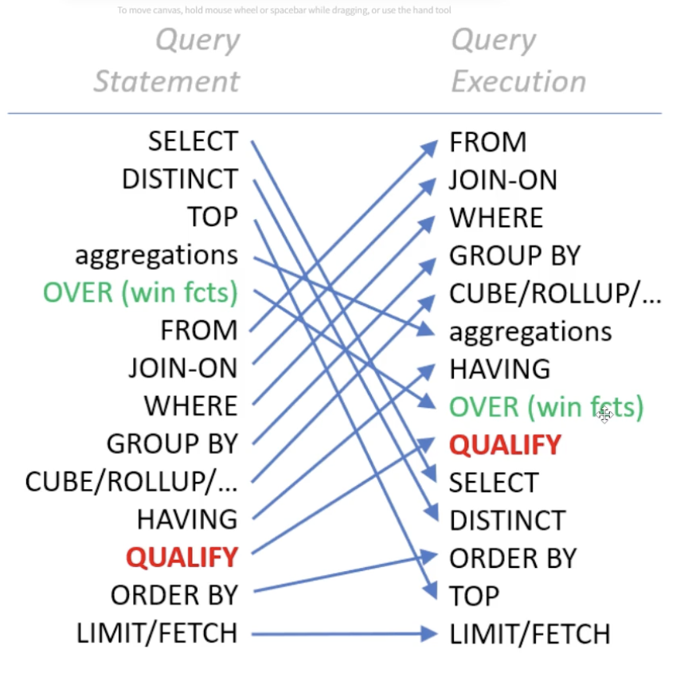

# Performance tuning em SQL: ordem de execução e otimização

## Ordem de consulta

A ordem de execução de uma query SQL é um dos conceitos mais importantes para quem trabalha com dados, e entendê-la muda completamente a forma como você escreve e otimiza consultas.



## Por que isso importa para um engenheiro de dados?

### Entender por que erros acontecem

A ordem lógica de execução é:

```sql
FROM / JOIN → WHERE → GROUP BY → HAVING → SELECT → ORDER BY → LIMIT
```

Isso explica, por exemplo, por que você não pode usar um alias do SELECT no WHERE:

```sql
-- ❌ Isso falha: WHERE é executado antes do SELECT
SELECT receita * 0.9 AS receita_liquida
FROM vendas
WHERE receita_liquida > 1000;

-- ✅ Correto
SELECT receita * 0.9 AS receita_liquida
FROM vendas
WHERE receita * 0.9 > 1000;
```

### Escrever queries mais eficientes

Saber que o WHERE roda antes do GROUP BY permite filtrar dados cedo, reduzindo o volume processado. Em pipelines com bilhões de linhas, isso é a diferença entre uma query de 2 segundos e uma de 20 minutos.

```sql
-- Melhor: filtra antes de agregar
SELECT cliente_id, SUM(valor)
FROM pedidos
WHERE data >= '2024-01-01'  -- reduz linhas antes do GROUP BY
GROUP BY cliente_id;
```

### Usar HAVING corretamente

HAVING filtra depois da agregação, enquanto WHERE filtra antes. Confundir os dois gera resultados errados ou queries desnecessariamente lentas:

```sql
-- WHERE para colunas da tabela
-- HAVING para resultados de agregação
SELECT cliente_id, COUNT(*) AS total_pedidos
FROM pedidos
WHERE status = 'concluído'       -- filtra linhas antes
GROUP BY cliente_id
HAVING COUNT(*) > 5;             -- filtra grupos depois
```

### Entender o comportamento de Window Functions

Window functions rodam depois do WHERE e GROUP BY, mas antes do ORDER BY. Isso significa que elas operam sobre o conjunto já filtrado — essencial para evitar cálculos incorretos em análises de churn, rankings e séries temporais.

### Otimizar com o query planner

Engenheiros de dados frequentemente precisam interpretar EXPLAIN / EXPLAIN ANALYZE. Sem saber a ordem de execução, o plano de execução do banco vira um ruído incompreensível.

## Exemplo em uma query

No exemplo abaixo, temos uma query normal e abaixo, a ordem de execução feita pelo SQL.

```sql
SELECT
  cars.manufacturer,
  cars.model,
  cars.country,
  cars.year,
  MAX(engines.horse_power) as maximum_horse_power
FROM cars
JOIN engines ON cars.engine_name = engines.name
WHERE cars.year > 2015 AND cars.country = 'Germany'
GROUP BY cars.manufacturer, cars.model, cars.country, cars.year
HAVING MAX(engines.horse_power)> 200
ORDER BY maximum_horse_power DESC
LIMIT 2
```


```sql
FROM cars
JOIN engines ON cars.engine_name = engines.name
WHERE cars.year > 2015 AND cars.country = 'Germany'
GROUP BY cars.manufacturer, cars.model, cars.country, cars.year
HAVING MAX(engines.horse_power) > 200
SELECT
  cars.manufacturer,
  cars.model,
  cars.country,
  cars.year,
  MAX(engines.horse_power) as maximum_horse_power
ORDER BY maximum_horse_power DESC
LIMIT 2
