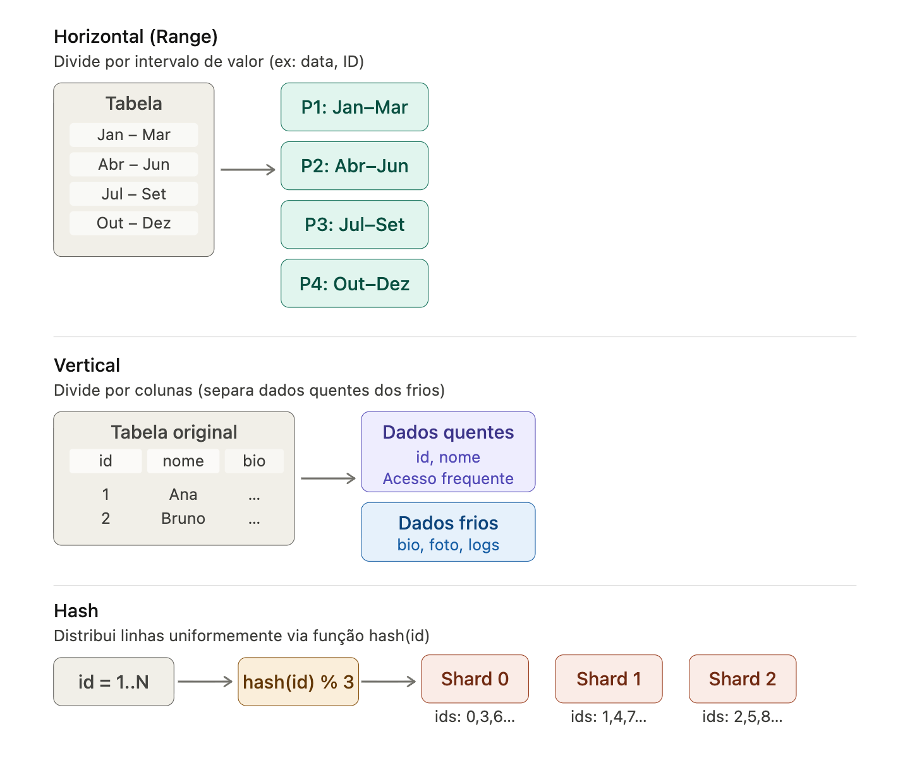
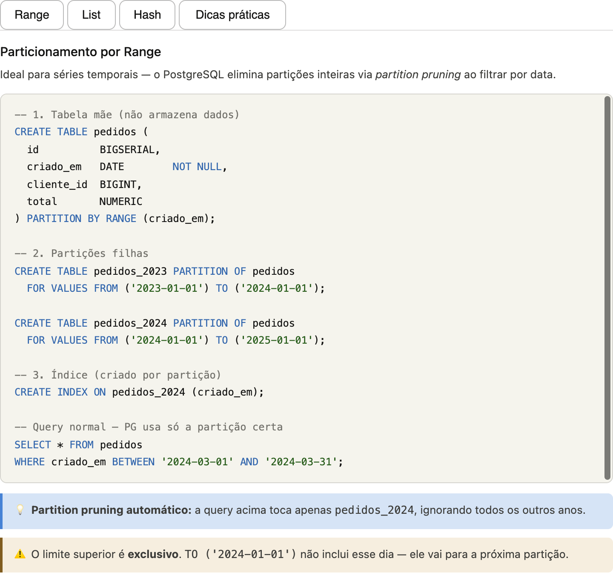
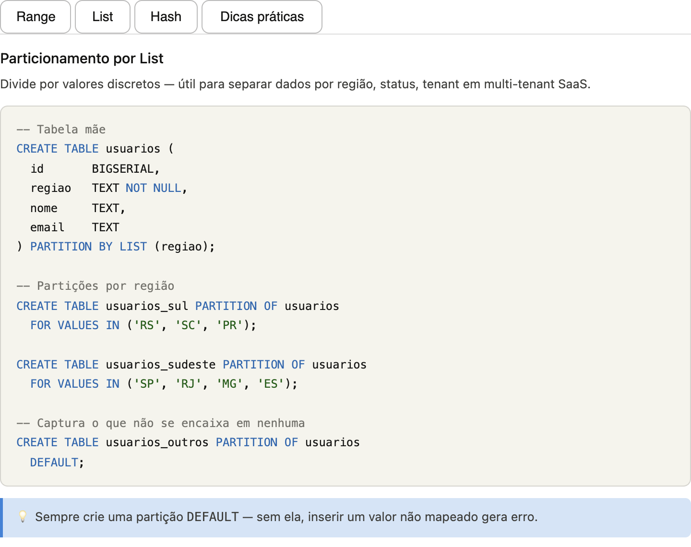
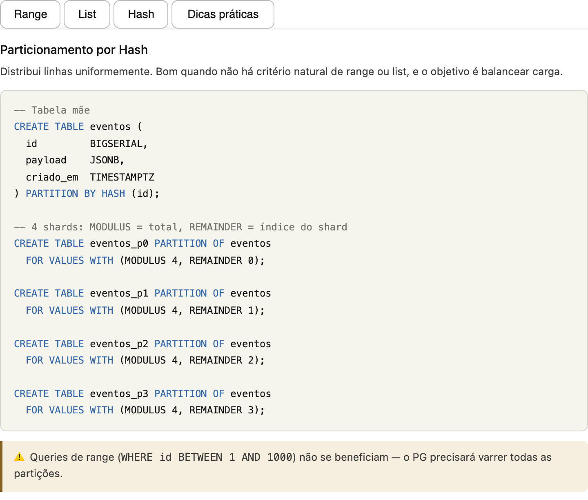

# Database partition

Particionamento de banco de dados é uma técnica de dividir uma tabela grande em partes menores e mais gerenciáveis. Aqui está um visual mostrando os três tipos principais:

Os três tipos principais são:

- Horizontal (Range) — cada partição armazena um subconjunto de linhas, geralmente por intervalo. Muito comum para dados temporais (particionar por mês, ano). Facilita muito queries com filtro de data, pois o banco descarta partições inteiras sem nem ler.

- Vertical — divide por colunas, separando as que são acessadas frequentemente (id, nome) das raramente acessadas (bio, foto, logs históricos). Reduz I/O porque as queries do dia a dia não precisam carregar colunas grandes e pouco usadas.

- Hash — aplica uma função hash sobre a chave primária e distribui as linhas uniformemente entre N shards. O objetivo é evitar hotspots — nenhum shard fica sobrecarregado. A desvantagem é que queries de range (entre id 1000 e 2000) ficam difíceis, pois os dados estão espalhados.

### Horizontal

### Vertical

### Hash

